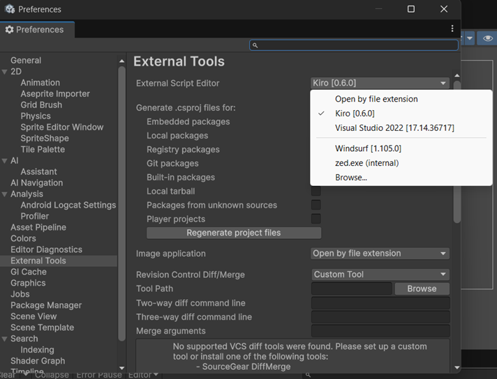

# Unity Kiro Editor Integration

Plugin tích hợp Kiro Editor với Unity, hỗ trợ IntelliSense, debugging và tự động tạo project files.

## Tính năng

- 🔍 Tự động phát hiện Kiro installation trên Windows, macOS và Linux
- 📝 Tạo file `.csproj` và `.sln` cho IntelliSense
- 🐛 Hỗ trợ debugging Unity projects
- ⚙️ Tự động cấu hình workspace (`.vscode/settings.json`, `launch.json`, `extensions.json`)
- 🔄 Đồng bộ project files khi có thay đổi
- 🧪 Tích hợp Unity Test Framework

## Cài đặt nhanh

✅ **Kiro có thể cùng tồn tại với Windsurf** - Không cần gỡ package cũ!

1. Mở Unity → **Window** → **Package Manager**
2. Click **"+"** → **"Add package from git URL..."**
3. Nhập: `https://github.com/YOUR_USERNAME/com.unity.ide.kiro.git`
4. Click **"Add"**
5. Chọn editor trong **Edit** → **Preferences** → **External Tools**

Xem [INSTALLATION.md](INSTALLATION.md) để biết thêm chi tiết.
Gặp vấn đề? Xem [TROUBLESHOOTING.md](TROUBLESHOOTING.md).

## Cấu hình

Sau khi cài đặt:
1. **Edit** → **Preferences** → **External Tools**
2. Chọn **Kiro** trong dropdown **External Script Editor**
3. Click **"Regenerate project files"**




## Yêu cầu

- Unity 2019.4 trở lên
- Kiro Editor

## Kiểm tra phát hiện Kiro (Windows)

Nếu Unity không tự động phát hiện Kiro, chạy script test:

```powershell
powershell -ExecutionPolicy Bypass -File test-kiro-detection.ps1
```

Script sẽ quét tất cả ổ đĩa và hiển thị vị trí Kiro được tìm thấy.

## Đóng góp

Contributions are welcome! Please feel free to submit a Pull Request.

## License

MIT License - xem [LICENSE.md](LICENSE.md) để biết thêm chi tiết.
